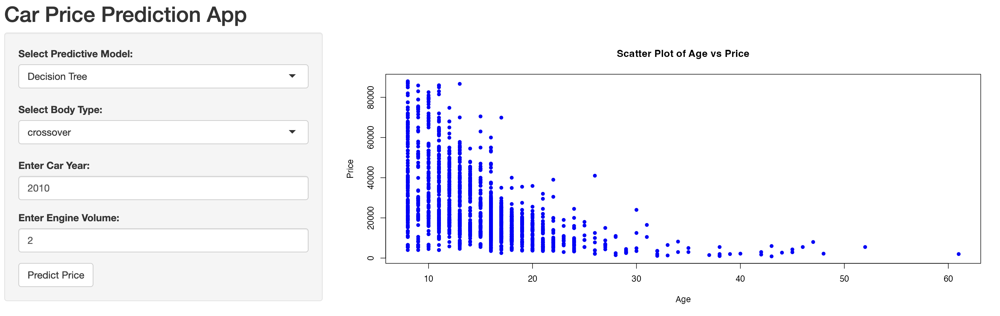

# 🚗 Car Price Prediction App (R Shiny)

## 📌 Overview  
This project is an interactive **Car Price Prediction Web Application** built using **R Shiny**. It predicts the price of used cars based on key features such as **car age, engine volume, and body type**.

The application integrates **data preprocessing, exploratory data analysis, and machine learning models** to provide real-time predictions through a user-friendly interface.

---

## 🧠 Models Used  
- Decision Tree (RPART)  
- Linear Regression  

---

## 🛠️ Tech Stack  
- R  
- Shiny  
- tidyverse (dplyr, tidyr, ggplot2)  
- randomForest  
- rpart & rpart.plot  
- corrplot  

---

## 📊 Data Preprocessing  

The dataset was cleaned and transformed using the following steps:

- Replaced invalid values (e.g., 0 in price and mileage) with NA  
- Imputed missing values using:
  - Mean (grouped by model, year, and body type)  
  - Mode for categorical variables (engine type)  
- Created a new feature:  
  - Age = 2024 - Year  
- Encoded categorical variables (drive type → numeric)  
- Removed irrelevant columns (car, year, drive)  
- Handled outliers using Z-score method (threshold = 3)  
- Removed remaining missing values  

---

## 📈 Exploratory Data Analysis  

- Analyzed missing values across columns  
- Created correlation matrix to identify relationships  
- Selected variables strongly correlated with price  
- Visualized relationships using scatter plots  

---

## 💻 Application Features  

- Interactive UI using Shiny  
- User input for:
  - Model type (Decision Tree / Linear Regression)  
  - Body type  
  - Year of car  
  - Engine volume  
- Real-time price prediction  
- Dynamic scatter plot visualization  



---

## ⚙️ How to Run the Project  

1. Clone the repository:
```bash
git clone https://github.com/your-username/car-price-prediction.git
